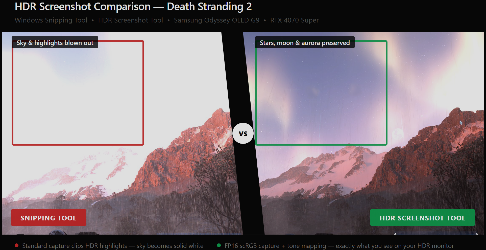

# HDR Screenshot Tool для Windows

Інструмент для захоплення HDR-скріншотів на Windows 10/11 з підтримкою тонмаппінгу та збереженням через системний трей.


---



## Навіщо це потрібно

Стандартні інструменти Windows (Ножиці, Win+PrintScreen) захоплюють скріни в SDR — HDR-деталі та яскраві бліки обрізаються або виглядають пересвіченими. Цей інструмент захоплює кадр у форматі **FP16 scRGB** безпосередньо через DXGI Desktop Duplication API, а потім застосовує тонмаппінг — так само як це робить OBS — і зберігає коректно відтонмаппований SDR PNG.

На відміну від інших інструментів захоплення екрана, працює коректно в будь-якому контексті — ігри, браузери, десктопні застосунки — оскільки захоплює на рівні compositor через DXGI, а не через GDI/BitBlt pipeline.

## Функціонал

- **Захоплення всього екрану** — хоткей (за замовчуванням `Ctrl+Shift+H`)
- **Захоплення регіону** — хоткей `Ctrl+Shift+R`, потягни мишею для вибору зони
- **HDR → SDR тонмаппінг** з налаштовуваною яскравістю (SDR white point в нітах)
- **Три алгоритми тонмаппінгу:** Windows/OBS-style (рекомендований), ACES filmic [тест], Reinhard [тест]
- **Автоматичне копіювання** в буфер обміну
- **Toast-сповіщення** з мініатюрою скріншоту після кожного захоплення
- **System tray** — програма живе у треї, не займає місця на таскбарі
- **Підтримка кількох моніторів** — захоплюється монітор під курсором
- **Fallback до SDR** — якщо HDR не підтримується, захоплення через dxcam BGRA
- **Автозапуск з Windows** — опціонально, вмикається в налаштуваннях

## Завантаження

> **Python не потрібен** — просто скачай і запусти.

| Файл | Опис |
|------|------|
| [hdr_screenshot_tool.exe](https://github.com/MagestiUA/HDR_Screenshot_tool_for_windows/releases/latest/download/hdr_screenshot_tool.exe) | Готовий exe-файл (Windows 10/11) |

> **Увага:** Windows SmartScreen може попередити про непідписаний файл. Дивись розділ [Вирішення проблем](#вирішення-проблем).

Або запусти з вихідного коду — дивись розділ [Встановлення](#встановлення).

## Вимоги

- Windows 10 версія 1703+ (теоретично) або Windows 11 (протестовано)
- HDR-сумісний монітор та GPU з увімкненим HDR у налаштуваннях Windows
- Python 3.11+

## Встановлення

```bash
git clone https://github.com/MagestiUA/HDR_Screenshot_tool_for_windows.git
cd HDR_Screenshot_tool_for_windows
python -m venv .venv
.venv\Scripts\activate
pip install -r requirements.txt
python main.py
```

## Налаштування

Правий клік на іконці в треї → **Settings…**

| Параметр | Опис |
|----------|------|
| Save folder | Папка для збереження скріншотів |
| Tone mapping | Алгоритм тонмаппінгу |
| SDR brightness (nits) | Яскравість SDR білого (160–480). Вище = темніший результат. Рекомендовано: 200–250 |
| Hotkey — Full screen | Хоткей для захоплення всього екрану |
| Hotkey — Region | Хоткей для вибору регіону |
| Start with Windows | Автозапуск при старті системи |

Конфігурація зберігається у `%LOCALAPPDATA%\HDRScreenshotTool\config.json` — програма коректно працює з будь-якої директорії, включно з `Program Files`, без прав адміністратора.

## Пакування в exe

```bash
pyinstaller --onefile --windowed --icon app.ico --add-data "app.ico;." main.py
```

Готовий файл буде у `dist\main.exe`.

## Можливі проблеми при запуску exe

### Windows Smart App Control / SmartScreen

На Windows 11 з увімкненим **Smart App Control** exe може бути заблокований із повідомленням _«Інтелектуальне керування програмами заблокувало потенційно небезпечну програму»_. Це стандартна поведінка для непідписаних виконуваних файлів від незнайомих видавців.

**Варіант 1 — вимкнути Smart App Control** (одноразово, не впливає на загальну безпеку системи):
> Параметри → Конфіденційність і безпека → Безпека Windows → Керування додатками і браузером → Smart App Control → **Вимкнути**

**Варіант 2 — запустити з вихідного коду** (не потребує жодних дозволів):
```bash
python main.py
```

**Варіант 3 — класичний SmartScreen** (якщо з'являється кнопка «Детальніше»):
> Натисніть «Детальніше» → «Все одно запустити»

### HDR захоплення повертає чорне або пошкоджене зображення

>Переконайся що HDR справді увімкнений у налаштуваннях дисплея Windows для твого монітора. Інструмент визначає стан HDR окремо для кожного монітора — якщо HDR вимкнений, автоматично перемикається на стандартне SDR захоплення.

### Скріншот виглядає так само як через Ножиці

>Можливо занадто висока яскравість SDR (nits) в налаштуваннях. Спробуй знизити до 200–250 нітів. Вищі значення більш агресивно стискають HDR діапазон, що робить результат схожим на SDR захоплення.

### Хоткей не спрацьовує

>Інший застосунок міг зареєструвати той самий хоткей глобально. Зміни хоткей у Налаштуваннях → Hotkey — Full screen або Hotkey — Region.

## Структура проекту

```
main.py              # точка входу, tray, хоткеї, workflow скріншота
capture.py           # пул камер, Win32↔DXGI маппінг моніторів
dxgi_capture/        # власна реалізація FP16 захоплення через DXGI
  capture.py         # FP16Capture клас, raw vtable D3D11 виклики
tonemapping.py       # алгоритми тонмаппінгу, збереження PNG
settings_window.py   # UI налаштувань (customtkinter)
overlay.py           # fullscreen оверлей для вибору регіону
clipboard_win.py     # копіювання у буфер обміну Windows
notification.py      # toast-сповіщення через PowerShell + WinRT
hdr_detect.py        # визначення HDR-стану монітора
config.py            # завантаження/збереження config.json
```

## Як це працює

1. При натисканні хоткею захоплюється поточний кадр монітора під курсором
2. Якщо монітор в режимі HDR — використовується `FP16Capture` (DXGI R16G16B16A16_FLOAT)
3. Отриманий float32 BGRA масив (scRGB лінійний, значення >1.0 = HDR-блики) передається в `tonemapping.to_sdr()`
4. Результат зберігається як PNG, копіюється в буфер обміну, з'являється toast-сповіщення

## Відомі обмеження

- Протестовано на Windows 11; Windows 10 теоретично підтримується
- Захищений контент (DRM) не захоплюється — обмеження DXGI
- Одночасно може працювати тільки один екземпляр програми; повторний запуск показує відповідне повідомлення

## Підтримати проект

Якщо інструмент виявився корисним, можна підтримати розробника банківським переказом (EUR):

**SEPA** (в межах Європи)
| | |
|---|---|
| IBAN | `GB63CLJU00997185802758` |
| BIC | `CLJUGB21` |
| Отримувач | `BILOIVAN MYKOLA` |

**SWIFT** (з усього світу, тільки EUR)
| | |
|---|---|
| IBAN | `UA113220010000026007310105358` |
| SWIFT/BIC | `UNJSUAUKXXX` |
| Отримувач | `PE BILOIVAN MYKOLA` |
| Адреса | `02088, Ukraine, Kyiv, st. Levadna, build 74` |

## Ліцензія

MIT
